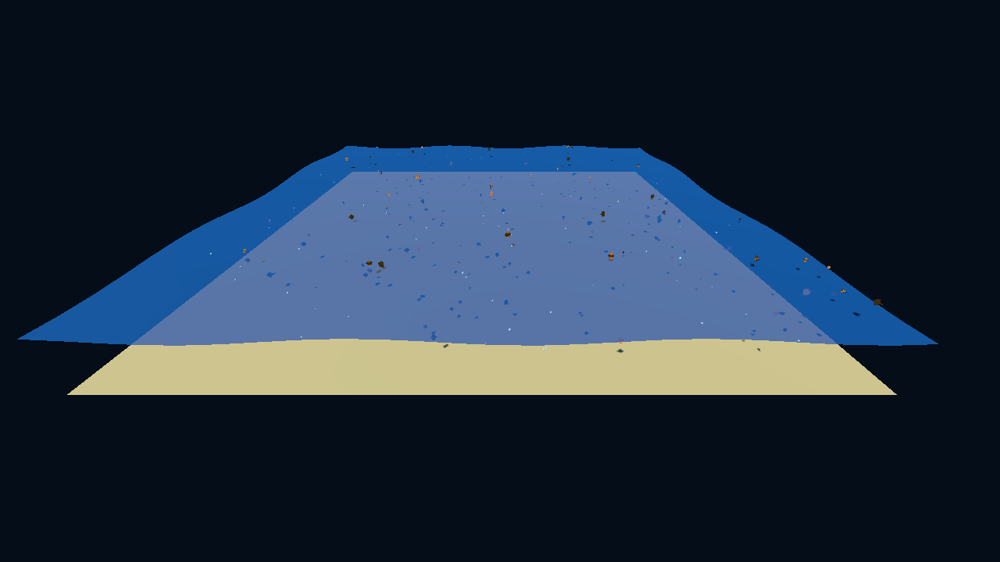

# Ocean Godot

A basic procedural ocean scene in [Godot 4.7](https://godotengine.org) (Forward+ renderer): a low-poly sea with animated waves, a school of 110 fish, rising bubbles, and a free-fly camera.

 

## Screenshot



*Captured headlessly via `get_viewport().get_texture().get_image().save_png()`
after 3 s of runtime. In this Godot 4.7.2 Arch build the same call from the
`res://` path produced black images, but the `user://` path works — see
`CHANGELOG.md` → "Notas de verificación".*

## Controls

| Key / mouse | Action |
|---|---|
| W A S D / arrows | Move camera |
| Mouse (right-drag) | Rotate camera (yaw/pitch) |
| Space / C | Up / down |
| Shift | Fast movement |
| F12 | Save screenshot |
| Esc | Quit |

## Run

```bash
cd ocean-godot && godot
```

Requires Godot 4.7+. The project was developed and verified on:

- Godot 4.7.2.stable.arch_linux (`ed1daf0bf`)
- AMD Radeon RX 7900 XT (RADV NAVI31), Vulkan 1.4.354
- CachyOS Linux (Wayland)

## Project layout

```
ocean-godot/
├── project.godot
├── CHANGELOG.md
├── scenes/
│   └── main.tscn          # Main scene (Node3D + scripts/main.gd)
└── scripts/
    └── main.gd            # Ocean, fish, bubbles, camera, input
```

Everything is generated procedurally at runtime — no external assets.

## Roadmap

See [CHANGELOG.md → Roadmap](CHANGELOG.md#roadmap--prximas-ideas-sin-confirmar).

## License

MIT (or whatever you'd like — ask JCDentonCore).
